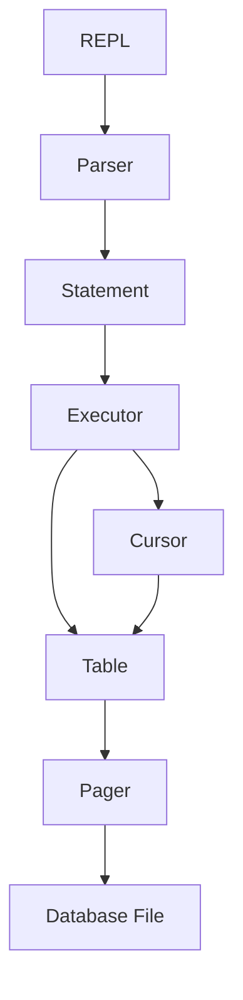

# SeroDB

SeroDB is an educational relational database engine written in C++17, inspired by the architecture of SQLite. It is built from scratch to demonstrate the internal components of a database storage engine, from query parsing down to page-level disk I/O.

## Architecture

SeroDB uses a layered storage engine architecture where each layer has a single responsibility:



- **REPL**: Command-line interface that reads input and formats query results.
- **Parser**: Validates input syntax and prepares typed statement objects or meta-commands.
- **Executor**: Executes statements against the active table.
- **Table**: Manages row slots across pages and handles serialization.
- **Cursor**: Provides forward iteration over rows across page boundaries.
- **Pager**: Manages 4096-byte page caching and disk read/write operations.

## Capabilities

- Interactive REPL with formatted table output
- `insert (id, username, email)` syntax
- `select` and `select *` queries
- Fixed 4096-byte page storage with lazy loading and caching
- Forward cursor iteration across page boundaries
- Meta-commands: `.help`, `.tables`, `.constants`, `.stats`, `.exit`
- Custom little-endian binary persistence
- Deterministic test suite with zero external dependencies

## Project Structure

```
SeroDB/
├── CMakeLists.txt              # Build configuration
├── README.md                   # Project overview
├── docs/                       # Developer documentation
│   ├── architecture.md         # Component breakdown and flow
│   ├── storage.md              # Page layout and I/O mechanics
│   ├── serialization.md        # Row encoding and endianness
│   ├── roadmap.md              # Planned milestones
│   └── testing.md              # Test runner and test cases
├── include/serodb/
│   ├── Constants.hpp           # Page size, row size, and limits
│   ├── Cursor.hpp              # Row iterator
│   ├── Executor.hpp            # Statement execution
│   ├── Pager.hpp               # Disk page cache and I/O
│   ├── Parser.hpp              # Command parsing
│   ├── Statement.hpp           # Statement and meta-command definitions
│   ├── Table.hpp               # Table and page-slot management
│   └── row.hpp                 # Row structure and validation
├── src/
│   ├── Cursor.cpp
│   ├── Executor.cpp
│   ├── Pager.cpp
│   ├── Parser.cpp
│   ├── Table.cpp
│   ├── main.cpp                # REPL entry point
│   └── row.cpp
└── tests/
    └── tests.cpp               # Test suite
```

## Building

### Requirements

- CMake 3.16 or newer
- C++17 compatible compiler (GCC 7+, Clang 5+, MSVC 2017+)

### Build Instructions

```sh
cmake -S . -B build
cmake --build build
```

The build produces two executables:
- `build/serodb` (or `build/serodb.exe` on Windows): Interactive REPL
- `build/serodb_tests` (or `build/serodb_tests.exe` on Windows): Unit and integration tests

## Usage

Start the REPL:

```sh
./build/serodb
```

### Example Session

```
serodb > insert (1, alice, alice@example.com)
Executed.
serodb > insert (2, bob, bob@example.com)
Executed.
serodb > select
id | username | email
---+----------+------------------
1  | alice    | alice@example.com
2  | bob      | bob@example.com
2 row(s).
serodb > .stats
Pages loaded:   1
Rows:           2
Database size:  0 bytes
serodb > .exit
```

## Documentation

Detailed design documentation is available in the [`docs/`](docs/) directory:

- [Architecture](docs/architecture.md)
- [Storage Layout](docs/storage.md)
- [Binary Serialization](docs/serialization.md)
- [Development Roadmap](docs/roadmap.md)
- [Testing Strategy](docs/testing.md)

## License

MIT License. See [LICENSE](LICENSE) for details.
