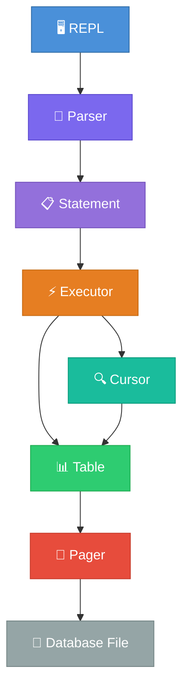

<div align="center">

# 🗄️ SeroDB

**A SQLite-inspired database engine built from scratch in modern C++**

[](https://isocpp.org/)
[](https://cmake.org/)
[](LICENSE)
[]()

*An educational project that explores how relational databases work internally —
from the REPL all the way down to the raw bytes on disk.*

</div>

---

## 📖 About

SeroDB is a **from-scratch database engine** inspired by the architecture of [SQLite](https://www.sqlite.org/arch.html). It is **not** a SQLite clone — it is a deliberate, milestone-driven learning project designed to teach how real databases work under the hood.

Every layer is written by hand in modern C++17 with no external dependencies, focusing on clarity and correctness over performance. If you've ever wondered what happens between typing `SELECT` and seeing rows appear on screen, this project walks through each step.

## ✨ Features

- 🖥️ **Interactive REPL** — Command-line interface with prompt and formatted output
- 📝 **INSERT & SELECT** — Insert rows and query all data with formatted table display
- 💾 **Binary Persistence** — Data survives restarts via a custom binary file format
- 📄 **Page-based Storage** — Fixed 4 KB pages with lazy loading and in-memory caching
- 🔍 **Cursor Iteration** — Forward-only cursor for scanning rows across pages
- ⚡ **Meta-commands** — `.help`, `.tables`, `.constants`, `.stats`, `.exit`
- 🧪 **17 Built-in Tests** — Comprehensive test suite with zero external dependencies
- 📚 **Heavily Commented** — Every file explains the *why*, not just the *what*

## 🏗️ Architecture

SeroDB follows a layered architecture similar to the early design of SQLite. Each layer has a single responsibility and communicates only with adjacent layers:



| Layer | Responsibility |
|-------|---------------|
| **REPL** | Read user input, dispatch commands, display results |
| **Parser** | Tokenize and validate input into Statements or MetaCommands |
| **Executor** | Execute parsed statements against the Table |
| **Table** | Map logical rows to physical page slots, serialize/deserialize |
| **Cursor** | Iterate over rows without exposing storage internals |
| **Pager** | Manage fixed-size pages — lazy loading, caching, flushing to disk |

## 📁 Project Structure

```
SeroDB/
├── CMakeLists.txt                  # Build configuration
├── README.md
│
├── include/serodb/                 # Public headers
│   ├── Constants.hpp               #   Page size, row geometry, limits
│   ├── Pager.hpp                   #   Page-level disk I/O
│   ├── Table.hpp                   #   Row storage abstraction
│   ├── Cursor.hpp                  #   Forward row iterator
│   ├── Executor.hpp                #   Statement execution engine
│   ├── Parser.hpp                  #   Command parsing
│   ├── Statement.hpp               #   Statement & meta-command types
│   └── row.hpp                     #   Row data structure
│
├── src/                            # Implementation
│   ├── main.cpp                    #   REPL entry point
│   ├── Pager.cpp                   #   Pager implementation
│   ├── Table.cpp                   #   Table + serialization logic
│   ├── Cursor.cpp                  #   Cursor implementation
│   ├── Executor.cpp                #   INSERT & SELECT execution
│   ├── Parser.cpp                  #   Parsing logic
│   └── row.cpp                     #   Row validation
│
└── tests/
    └── tests.cpp                   # 17 built-in tests
```

## 🚀 Getting Started

### Prerequisites

- **CMake** 3.16 or newer
- A **C++17-compatible** compiler (GCC 7+, Clang 5+, MSVC 2017+)

### Build

```sh
# Configure
cmake -S . -B build

# Build
cmake --build build
```

### Run

```sh
./build/serodb        # Linux / macOS
.\build\serodb.exe    # Windows
```

## 💻 Example REPL Session

```
serodb > insert (1, alice, alice@example.com)
Executed.
serodb > insert (2, bob, bob@example.com)
Executed.
serodb > insert (3, charlie, charlie@example.com)
Executed.
serodb > select
id | username | email
---+----------+--------------------
1  | alice    | alice@example.com
2  | bob      | bob@example.com
3  | charlie  | charlie@example.com
3 row(s).
serodb > .stats
Pages loaded:   1
Rows:           3
Database size:  0 bytes
serodb > .constants
Page size:      4096 bytes
Row size:       291 bytes
Rows per page:  14
Max pages:      100
Max rows:       1400
serodb > .exit
```

## 💾 Binary Storage Format

SeroDB stores data in a custom binary format designed for simplicity and educational clarity.

### File Layout

```
┌─────────────────────────────────────────────┐
│  Page 0                                     │
│  ┌─────────────────────────────────────────┐ │
│  │ Header (12 bytes)                       │ │
│  │   Magic:     "SeroDB1\0"  (8 bytes)     │ │
│  │   Row count: uint32 LE    (4 bytes)     │ │
│  ├─────────────────────────────────────────┤ │
│  │ Row 0  (291 bytes)                      │ │
│  │ Row 1  (291 bytes)                      │ │
│  │ ...                                     │ │
│  │ Row 13 (291 bytes)                      │ │
│  └─────────────────────────────────────────┘ │
├─────────────────────────────────────────────┤
│  Page 1                                     │
│  ┌─────────────────────────────────────────┐ │
│  │ Row 14 (291 bytes)                      │ │
│  │ Row 15 (291 bytes)                      │ │
│  │ ...                                     │ │
│  │ Row 27 (291 bytes)                      │ │
│  └─────────────────────────────────────────┘ │
├─────────────────────────────────────────────┤
│  Page 2 ...                                 │
└─────────────────────────────────────────────┘
```

### Row Layout (291 bytes, fixed-width)

| Field | Size | Format |
|-------|------|--------|
| `id` | 4 bytes | `uint32`, little-endian |
| `username` | 32 bytes | Fixed-width, null-padded |
| `email` | 255 bytes | Fixed-width, null-padded |

### Key Design Decisions

- **Fixed page size** (4096 bytes) — matches OS page size and SQLite's default
- **Rows never split** across page boundaries — simpler reads, minor space tradeoff
- **Page 0 header** — file magic + row count occupies the first 12 bytes (similar to SQLite's 100-byte database header on page 1)
- **Lazy page loading** — pages are read from disk only when first accessed
- **Little-endian integers** — portable binary format, explicit byte ordering

## 🧪 Testing

SeroDB includes a self-contained test suite with **17 tests** covering every layer of the architecture:

```sh
# Run tests
./build/serodb_tests        # Linux / macOS
.\build\serodb_tests.exe    # Windows
```

```
========================================
  SeroDB Test Suite
========================================

[ PASS ] Row validation
[ PASS ] Parser INSERT
[ PASS ] Parser SELECT
[ PASS ] Parser invalid commands
[ PASS ] Parser meta-commands
[ PASS ] Constants sanity
[ PASS ] Pager round-trip
[ PASS ] Pager stats
[ PASS ] Pager flush
[ PASS ] Serialization round-trip
[ PASS ] Table insert multiple
[ PASS ] Table persistence
[ PASS ] Empty database
[ PASS ] Cursor on empty table
[ PASS ] Cursor traversal
[ PASS ] Multi-page spanning
[ PASS ] Executor INSERT + SELECT

========================================
  Results: 17/17 passed, 0 failed
========================================
```

No external test framework required — the test runner is a simple macro-based system built into the project.

## 📋 Current Capabilities

| Feature | Status |
|---------|--------|
| Interactive REPL | ✅ |
| INSERT rows | ✅ |
| SELECT all rows | ✅ |
| Binary persistence | ✅ |
| Page-based storage | ✅ |
| Lazy page loading | ✅ |
| In-memory page cache | ✅ |
| Cursor-based iteration | ✅ |
| Meta-commands | ✅ |
| Comprehensive test suite | ✅ |

## 🗺️ Roadmap

SeroDB is being built incrementally, one milestone at a time. Each milestone adds a new database concept:

- [x] **Milestone 1** — REPL + row representation
- [x] **Milestone 2** — Binary serialization + persistence
- [x] **Milestone 3** — Command parser + statement system
- [x] **Milestone 4** — Pager + Table + Cursor architecture
- [ ] **Milestone 5** — B+Tree index structure
- [ ] **Milestone 6** — SQL tokenizer + parser
- [ ] **Milestone 7** — WHERE clause filtering
- [ ] **Milestone 8** — DELETE + UPDATE operations
- [ ] **Milestone 9** — Multi-table support
- [ ] **Milestone 10** — Transactions + rollback

## 🎓 Design Inspiration

SeroDB's architecture is directly inspired by [SQLite](https://www.sqlite.org/arch.html), one of the most widely deployed software libraries in the world. Key parallels:

| SQLite Concept | SeroDB Equivalent |
|---------------|-------------------|
| `sqlite3_prepare_v2()` | `Parser::prepareStatement()` |
| `sqlite3_step()` | `Executor::execute()` |
| `sqlite3PagerGet()` | `Pager::get_page()` |
| `sqlite3BtreeCursor` | `Cursor` class |
| Database header (100 bytes on page 1) | File header (12 bytes on page 0) |

> **Note:** SeroDB is not a SQLite clone. It is a simplified, educational implementation that follows the same architectural *philosophy* — clear layer separation, page-based storage, and cursor-driven iteration — but makes many simplifications for clarity.

For more on SQLite internals, see:
- [SQLite Architecture](https://www.sqlite.org/arch.html)
- [SQLite File Format](https://www.sqlite.org/fileformat2.html)
- [Let's Build a Simple Database](https://cstack.github.io/db_tutorial/) by Connor Stack

## 🤝 Contributing

Contributions are welcome! This is an educational project, so clarity and simplicity are valued over cleverness.

1. Fork the repository
2. Create a feature branch (`git checkout -b feature/your-feature`)
3. Make your changes
4. Ensure all tests pass (`./build/serodb_tests`)
5. Commit with a descriptive message
6. Open a Pull Request

### Guidelines

- Write clean, readable C++17
- Add comments explaining *database concepts*, not obvious code
- Keep functions small and focused
- Add tests for new functionality
- Follow the existing code style

## 📄 License

This project is licensed under the [MIT License](LICENSE).

---

<div align="center">

*Built with ❤️ as a learning project in systems programming.*

**[⬆ Back to top](#️-serodb)**

</div>
