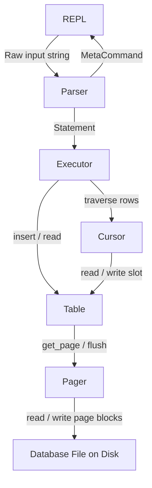
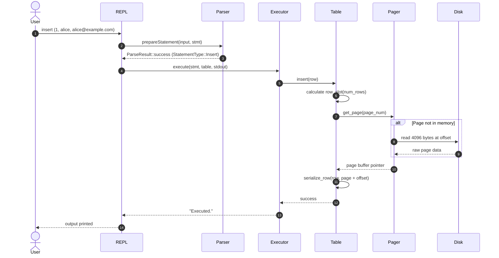

# Architecture

This document describes the architectural layers of SeroDB, their responsibilities, and how data and execution flow through the system.

## Overview

SeroDB uses a layered design inspired by SQLite's virtual machine and storage architecture. Each layer is decoupled and communicates only with its direct neighbors.

## Component Responsibilities

### 1. REPL (`src/main.cpp`)

The Read-Eval-Print Loop is the user interface layer.
- Prompts the user (`serodb > `) and reads lines from standard input.
- Passes meta-commands (prefixed with `.`) to the meta-command dispatcher.
- Hands SQL-like commands to the Parser and Executor.
- Coordinates database startup and graceful shutdown (`.exit`).

### 2. Parser (`serodb/Parser.hpp`, `src/Parser.cpp`)

The Parser handles input tokenization, syntax validation, and statement preparation.
- `parse_meta_command`: Identifies dot-commands (`.exit`, `.help`, `.tables`, `.constants`, `.stats`).
- `prepareStatement`: Validates statement syntax (`insert`, `select`), checks field constraints (e.g. maximum length of string fields, 32-bit unsigned integer ID), and populates a typed `Statement` structure.
- Returns explicit status codes via `ParseResult` and `MetaCommandResult` to prevent executing malformed queries.

### 3. Executor (`serodb/Executor.hpp`, `src/Executor.cpp`)

The Executor performs the requested database action using prepared statements.
- **INSERT**: Validates capacity, delegates row insertion to `Table::insert`, and reports execution status.
- **SELECT**: Obtains a `Cursor` pointing to the beginning of the table, scans rows sequentially until `cursor.end()`, calculates column display widths dynamically, and prints the formatted table.

### 4. Table (`serodb/Table.hpp`, `src/Table.cpp`)

The Table layer represents a single relational table backed by paged storage.
- Owns the `Pager` instance for the database file.
- Translates logical row numbers (e.g. Row 0, Row 15) to physical coordinates `(page_index, byte_offset)` via `row_slot()`.
- Reads and updates the 12-byte database header on Page 0 (file magic string + total row count).
- Handles binary serialization and deserialization between in-memory `Row` structs and raw page buffers.

### 5. Cursor (`serodb/Cursor.hpp`, `src/Cursor.cpp`)

The Cursor abstracts sequential traversal over table rows across page boundaries.
- Created via factory methods `Cursor::table_start(table)` or `Cursor::table_end(table)`.
- `advance()`: Moves forward by one logical row and updates the `end()` state.
- `read()`: Deserializes the `Row` currently pointed to by the cursor.
- `write()`: Serializes a `Row` directly into the current page buffer.
- `value()`: Returns a direct pointer to the serialized bytes within the underlying page.

### 6. Pager (`serodb/Pager.hpp`, `src/Pager.cpp`)

The Pager manages low-level file I/O and page-level memory caching.
- Treats the database file as an array of fixed-size blocks (4096 bytes).
- Implements lazy loading: a page is read from disk only when `get_page(page_num)` is called.
- Maintains an in-memory page cache so multiple accesses to the same page require zero disk I/O.
- Writes dirty pages back to disk individually via `flush(page_num)` or all at once on `close()`.

### 7. Row (`serodb/row.hpp`, `src/row.cpp`)

The in-memory data representation for a single record.
- Holds `id` (32-bit unsigned integer), `username` (string), and `email` (string).
- Provides static and member validation routines (`is_valid()`, `is_valid_username()`, `is_valid_email()`).

## Execution Flow Example

### INSERT Execution Flow

